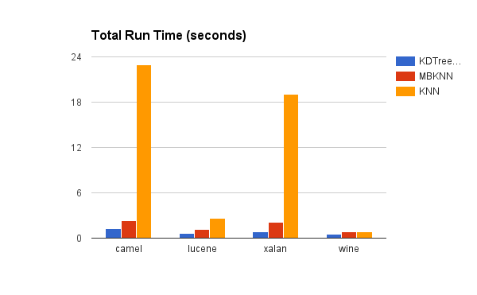

# Homework 4
## Big Project

See [``project.md``](https://github.com/tdgoodrich/fss16tdg/tree/master/project/description.md)

## Nearest Neighbor

### Table

The ``Table`` class is by far the most coding and thought required for this assignment. A lot of my mentality shift was going from "Table is a place to read in the initial data from a file" to "Table is the container that all row-based data needs to occupy". Being able to initialize with or without a file, add rows at will, and iterate through rows (with the choice to do features only) were all added and made my life much better.

### KNN

Once ``Table.py`` was up to snuff, "training" KNN was as simple as populating the ``Table``:

```python
def __init__(self, k, training_data):
    self.k = k
    self.table = Table(training_data)
```

and predicting as easy as finding the mode class of the k-closest neighbors:

```python
def predict(self, row):
    # Compute the k closest rows in the training table
    k_closest = sorted(list(self.table.row_distances(row)),
      key=lambda item: item.distance)[:self.k]

    frequencies = {}
    for row in k_closest:
        outcome = row.row.outcomes[0] # Assuming one outcome
        frequencies[outcome] = frequencies.get(outcome, 0) + 1
    return max(frequencies, key=frequencies.get)
```

For the longest time I was getting wacky output from ``KNN.py`` as a classifier, then I realized my debugging print was being interpreted as a prediction. Doh!


### Mini-Batch K-Means

The ``MiniBatchKNN`` training method was really just a straightforward implementation from the original paper. I stored the centroids as a ``Row`` plus an index in a ``Table``, so finding the closest centroid was as simple as calling the ``closest(row)`` method in ``Table``. I then kept a ``centroid_clusters`` dictionary of ``Table``s indexed by centroid indices, so I could easily look up the rows in each centroid's cluster. From there, the testing method was the same as in ``KNN.py``:

```python
def predict(self, row):
    closest_centroid = self.centroid_table.closest(row)
    closest_cluster = self.centroid_clusters[closest_centroid.index]

    k_closest = sorted(list(closest_cluster.row_distances(row)),
      key=lambda item: item.distance)[:self.k_nearest]

    frequencies = {}
    for row in k_closest:
        outcome = row.row.outcomes[0] # Assuming one outcome
        frequencies[outcome] = frequencies.get(outcome, 0) + 1
    return max(frequencies, key=frequencies.get)
```

### KD-Trees

I used the Python recipe provided for ``KDTree``. The rough structure was taken from my other classifiers, all that remained was to hook up the prediction method to their interface:

```python
def predict(self, row):
    featues, outcomes, dist = self.nearest_neighbor(row.features)
    return outcomes[0]
```

### Data processing

To prepare the datasets I wrote a few scripts. For the CK datasets I converted the bug count to a boolean "Has bug?" class, and removed the first few columns that contained non-useful symbolic data. The conversion script can be found at ``data/kc_converter.py``.

After the initial experiments, I took the wine.arff dataset from CODE6 and used it here as well. Its script is found at ``6/data/wine_converter.py``.

### Output

For datasets, I chose CK datasets with varying percents of the target class (always ``true`` for having bugs). For wine, we target the first wine.

| Dataset  | URL  | Rows   | Features  | Classes | % target class  |
|---|---|---|---|---|
| bool_camel-1.6.arff  | [PROMISE Repo](http://openscience.us/repo/defect/ck/camel.html)   | 965  | 20  | 2  | 19% |
| bool_lucene-2-4.arff  | [PROMISE Repo](http://openscience.us/repo/defect/ck/lucene.html)   | 340  | 20  | 2  | 60% |
| bool_xalan-2.7.arff  | [PROMISE Repo](http://openscience.us/repo/defect/ck/xalan.html)   | 909  | 20  | 2  | 98% |
| wine.arff | [UCI Repo](https://archive.ics.uci.edu/ml/datasets/Wine)  | 178 | 13 | 3 | 33% |

```
bool_camel-1.6.arff

pd
rank ,         name ,    med   ,  iqr
----------------------------------------------------
   1 ,        zeror ,       0  ,     0 (*              |              ), 0.00,  0.00,  0.00,  0.00,  0.00
   2 ,        mbknn ,      64  ,    11 (               |  --  *---    ),54.00, 60.00, 64.00, 68.00, 76.00
   3 ,        kdknn ,      69  ,    12 (               |  ---  * -    ),54.00, 63.00, 69.00, 73.00, 77.00
   3 ,          knn ,      74  ,    13 (               |   ---   *-   ),57.00, 64.00, 74.00, 76.00, 79.00

pf
rank ,         name ,    med   ,  iqr
----------------------------------------------------
   1 ,        zeror ,       0  ,     0 (*              |              ), 0.00,  0.00,  0.00,  0.00,  0.00
   2 ,          knn ,       7  ,     4 (        ----  *|   --         ), 4.00,  6.00,  7.00,  9.00, 10.00
   2 ,        kdknn ,       9  ,     3 (          ---- |   * ----     ), 5.00,  7.00,  9.00, 10.00, 12.00
   2 ,        mbknn ,       9  ,     3 (          ---- |   * ----     ), 5.00,  7.00,  9.00, 10.00, 12.00
```


```
bool_lucene-2-4.arff

pd
rank ,         name ,    med   ,  iqr
----------------------------------------------------
   1 ,        mbknn ,      84  ,    10 (       -----   *   -----      ),74.00, 80.00, 84.00, 88.00, 94.00
   1 ,        kdknn ,      86  ,     7 (        -------| *  -----     ),76.00, 84.00, 86.00, 89.00, 95.00
   1 ,          knn ,      88  ,     7 (              -|   * ----     ),82.00, 85.00, 88.00, 90.00, 95.00
   2 ,        zeror ,     100  ,     0 (               |             *),100.00, 100.00, 100.00, 100.00, 100.00

pf
rank ,         name ,    med   ,  iqr
----------------------------------------------------
   1 ,          knn ,      20  ,     8 ( -- *-         |              ),11.00, 17.00, 20.00, 23.00, 26.00
   1 ,        kdknn ,      21  ,    15 (--- *  -       |              ),10.00, 17.00, 21.00, 30.00, 33.00
   1 ,        mbknn ,      23  ,     8 (  -- *---      |              ),15.00, 22.00, 23.00, 28.00, 37.00
   2 ,        zeror ,     100  ,     0 (               |             *),100.00, 100.00, 100.00, 100.00, 100.00
```


```
bool_xalan-2-7.arff

pd
rank ,         name ,    med   ,  iqr
----------------------------------------------------
   1 ,          knn ,     100  ,     1 (               |             *),99.00, 99.00, 100.00, 100.00, 100.00
   1 ,        zeror ,     100  ,     0 (               |             *),100.00, 100.00, 100.00, 100.00, 100.00
   1 ,        kdknn ,     100  ,     0 (              -|-------------*),99.00, 100.00, 100.00, 100.00, 100.00
   1 ,        mbknn ,     100  ,     1 (               |             *),99.00, 99.00, 100.00, 100.00, 100.00

pf
rank ,         name ,    med   ,  iqr
----------------------------------------------------
   1 ,        kdknn ,       0  ,    33 (*        ------|----          ), 0.00,  0.00,  0.00, 33.00, 67.00
   1 ,          knn ,       1  ,    33 (*        ------|----          ), 0.00,  0.00,  1.00, 33.00, 67.00
   1 ,        mbknn ,       1  ,    33 (*        ------|----          ), 0.00,  0.00,  1.00, 33.00, 67.00
   1 ,        zeror ,     100  ,     0 (---------------|-------------*), 0.00, 100.00, 100.00, 100.00, 100.00
```

```
wine.arff

pd
rank ,         name ,    med   ,  iqr
----------------------------------------------------
   1 ,        zeror ,       0  ,     0 (*--------------|------------- ), 0.00,  0.00,  0.00,  0.00, 100.00
   1 ,        kdknn ,      93  ,    10 (               |         --*  ),86.00, 91.00, 93.00, 100.00, 100.00
   1 ,          knn ,     100  ,     0 (               |             *),100.00, 100.00, 100.00, 100.00, 100.00
   1 ,        mbknn ,     100  ,     0 (               |             *),100.00, 100.00, 100.00, 100.00, 100.00

pf
rank ,         name ,    med   ,  iqr
----------------------------------------------------
   1 ,          knn ,       0  ,     4 (*-             |              ), 0.00,  0.00,  0.00,  0.00,  8.00
   1 ,        zeror ,       0  ,     0 (*--------------|------------- ), 0.00,  0.00,  0.00,  0.00, 100.00
   1 ,        mbknn ,       0  ,     5 (*-             |              ), 0.00,  0.00,  0.00,  5.00,  9.00
   1 ,        kdknn ,       5  ,     8 ( *-            |              ), 0.00,  0.00,  5.00,  5.00, 11.00

```

Beyond camel, all versions of KNN performed roughly the same, and on camel the mini-batch KNN had a slightly lower-than-median recall. However, in timing we see the real difference:




Based on the much faster run time and indistinguishable solution quality, I would recommend using KDTrees.
