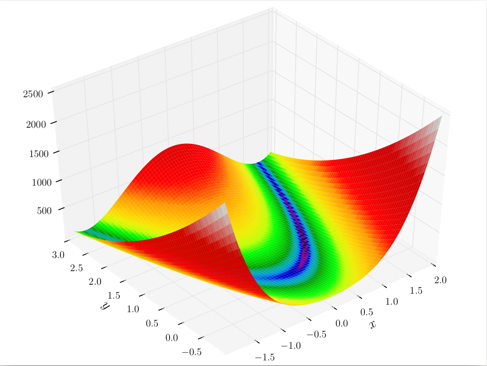
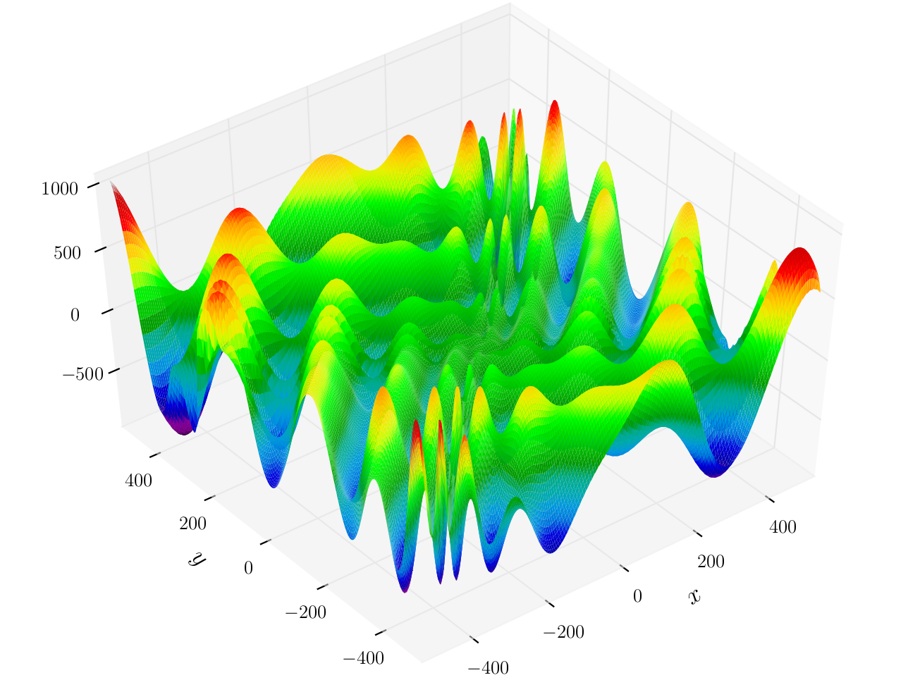

# Big Project Description
### Motivation

Search-Based Software Engineering (SBSE) reduces software engineering problems such as test generation and defect prediction to _combinatorial optimization problem_ models, where an extremal (minimal or maximal) point in the model's _fitness landscape_ corresponds to an optimal solution to the software engineering problem. Once constructed, these models are frequently explored with heuristics such as gradient descent, simulated annealing, and genetic algorithms. Choosing a proper heuristic depends on the specific fitness landscape of the model (Figure 1). From a business standpoint, choosing an appropriate heuristic is a practical concern, since using heavy machinery than needed can be a waste of time and compute resources.

Smooth Landscape (Rosenbrock Function) | Brittle Landscape (Eggholder Function)
:-:|:-:
  |  

**Figure 1**: Smooth landscapes can be traversed with lightweight, fast heuristics like gradient descent. Brittle landscapes require heavier machinery such as genetic algorithms. Figures from [Wikipedia's Test Functions for Optimization](https://en.wikipedia.org/wiki/Test_functions_for_optimization).

### Problem Statement

One difficulty in SBSE is that understanding a problem's fitness landscape quickly becomes intractable as the number of variables and fitness functions increase. In both landscapes from Figure 1, the models had one fitness function and two input variables -- perfect for a 3d plot. What if we have more variables? More fitness functions? What happens when the cost of evaluating this many points is too high? In each of these scenarios, we cannot create such concise 3d plots and need a different form of visualization.

The question I want to address is _Given a SBSE problem, how can we visualize fitness function landscapes a priori?_ (e.g. before running the main heuristics, but possibly including a fast, pilot heuristic run). The problem is not just to visualize, but to achieve the level of intuition provided by the 3d plots.

### Proposed Work and Artifacts

Broadly, to address this problem, I propose to create an interactive dashboard where users can load energy landscapes, view _concise_ and _useful_ visualized statistics, and see how these statistics react to different transformations (e.g. Fourier series, discretization, etc.).

Some expected steps/artifacts:
1. A literature review to identify how fitness landscapes can be concisely represented. For example, Harman [1] notes how Gross et al. [2-3] estimate the distance of a greedy solution from the global optima.

2. An interactive dashboard. I plan to use a browser-based dashboard using Python for back-end, Flask for front-end Python support, Bootstrap for layout control, and d3 for visualization.

3. Tests using tractable synthetic data (e.g. the [Test Functions for Optimization](https://en.wikipedia.org/wiki/Test_functions_for_optimization)). (Too vague)

4. Recreation and evaluation of real-world (a) SBSE model formulations and (b) the heuristics that authors have applied to these models. (Too vague, find some citations)

5. A final report summarizing all of the above and an open source package for the dashboard.

### Bibliography

[1] Harman, M. (2010, September). The relationship between search based software engineering and predictive modeling. In Proceedings of the 6th International Conference on Predictive Models in Software Engineering (p. 1). ACM. [Link](http://dl.acm.org.prox.lib.ncsu.edu/citation.cfm?id=1868330&CFID=834066909&CFTOKEN=51601709)

[2] Gross, H. G., Jones, B. F., & Eyres, D. E. (2000). Structural performance measure of evolutionary testing applied to worst-case timing of real-time systems. IEE Proceedings-Software, 147(2), 25-30. [Link](http://ieeexplore.ieee.org/document/871132/?arnumber=871132&tag=1)

[3] Groß, H. G., & Mayer, N. (2002, July). Evolutionary Testing In Component-based Real-time System Construction. In GECCO Late Breaking Papers (pp. 207-214). [Link](https://www.researchgate.net/profile/Hans-Gerhard_Gross/publication/220741428_Evolutionary_Testing_In_Component-based_Real-time_System_Construction/links/09e4150be6c66571df000000.pdf)
