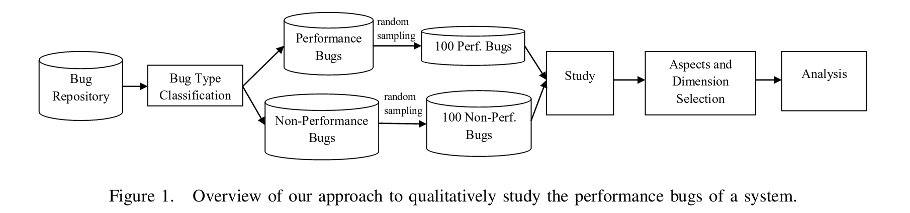

# READ1

### Citation

Zaman, S., Adams, B., & Hassan, A. E. (2012, June). A qualitative study on performance bugs. In Mining Software Repositories (MSR), 2012 9th IEEE Working Conference on (pp. 199-208). IEEE. [Paper link](http://ieeexplore.ieee.org/document/6224281/).

### Summary

This paper _qualitatively_ studies performance issues in two datasets, Firefox and Chrome. The authors found that performance bugs are particularly tricky because of (a) reproducibility and (b) more required discussion than other types of bugs.

### Keywords

* ii1. Performance bug: Problems that affect the practical performance of a program, such as high resource utilization or slow response times.
* ii2. Qualitative features: Features that cannot be gauged quantitatively. For example, a quantitative measure is the number of developers on the project, and a qualitative measure is the personalities of the developers on the project.
* ii3. Regression bugs: Software regression happens when a feature stops working as intended after an event (upgrade, reboot, etc.).
* ii4. WorksForMe: A bug category for Mozilla software that identifies when a bug occurs for a particular user with a particular setup, but not the user base in general. WorksForMe bugs are hard to reproduce.

### Main Items

* iii1. Motivational statements/related work. The authors note that there has not been much research on performance bugs. They note that previous work in _defect prediction_ typically includes performance bugs under the general umbrella of "bugs", making no distinction between other types such as security bugs. They claim, however, that performance bugs are particularly tricky, citing their previous result that found performance bugs take 32% longer to fix, on average. The motivation for this particular paper is to examine _qualitative_ features of the data (content of discussions, people involved, etc.) as opposed to _quantitative_ features (time to fix, number of developers involved, etc.).

* iii2. Informative visualizations. In Figure 1, the authors provide a visualization of the structure of their qualitative study. I found this visualization very helpful in outlining the next few pages of text (Section II), where they outline the very specific detail of their analysis.

 

* iii3. Sampling procedures. The authors note that they chose to study web browsers because performance is a primary quality requirement, and particularly chose to study Firefox and Chrome since they (a) were the two most popular web browsers, and (b) offered publicly available bug tracking data. The authors provide very specific details about how the data was sampled from these repositories, such as taking Firefox data from September 9, 1994 to August 15, 2010, taking the Mozilla Core and Firefox branches of this data, and identifying performance bugs by the keywords "perf", "slow", and "hang" in the bug report title and keyword fields.

* iii4. Baseline results. The authors do a very nice job of presenting their baseline results at the end of Section I and in detail in Section III. The results are split into four categories, pertaining to potentially different audiences: (i) Impact on the stakeholder, (ii) Context of the bug, (iii) The bug fix, and (iv) Bug Fix Validation. I will not mention all the results here, but one that I found particularly interesting is that in 8% of Firefox performance bugs, the submitter threatened to switch browsers, compared to 1% for non-performance bugs.

# Improvements

* iv1. Provide a link to the scripts used. While the authors meticulously described how they selected their data and evaluated bugs, they do not provide a link to their scripts or the data. This choice makes their results technically, but not easily, reproducible

* iv2. Evaluate their experiment with multiple authors. In Section V, Threats to Validity, the authors note that their work is inherently subjective, but that only one author performed the qualitative analysis. A second analysis would have provided reassurance in their conclusions.

* iv3. Needs a future work section. The results and clear and interesting, but the story ends with a vague "We plan on performing case studies on other open source software systems..." In particular, it would have been interesting to hear what the authors would look for in the other case studies (e.g. "Do these results hold in the Microsoft ecosystem with Internet Explorer?", "Do these results hold with less popular browsers?", etc.).
