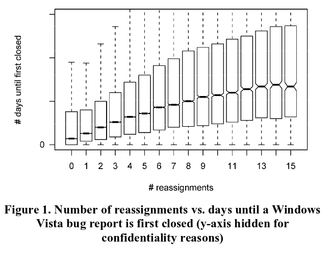

# READ4

### Citation

Guo, P. J., Zimmermann, T., Nagappan, N., & Murphy, B. (2011, March). Not my bug! and other reasons for software bug report reassignments. In Proceedings of the ACM 2011 conference on Computer supported cooperative work (pp. 395-404). ACM. [Paper link](http://dl.acm.org/citation.cfm?id=1958887).

### Summary

The authors study bug report reassignment -- finding the right person for the bug. They use a Microsoft Windows Vista operating system dataset and concentrate on the social interactions of bug reassignments.

### Keywords

* ii1. Bug reporting: When a user or developer finds and records a bug in a software project.
* ii2. Bug reassignment: The act of reassigning which developer will fix a certain reported bug.
* ii3. CSCW: Computer-Supported Cooperative Work. For example, using an issue tracker to cooperatively develop a project.
* ii4. Descriptive statistical model. This model infers relationships from existing data, in contrast to a _predictive model_.

### Main Items

* iii1. Motivational statements. The authors note that while social interactions in software engineering has been widely studied, the reassignment of bugs in particular has not been studied. They claim that folklore dictates that bug reassignments are by definition a harmful event, yet note that no particular evidence supports this claim.
* iii2. Visualizations. On the first page, the authors provide Figure 1:

  This image is particularly informative because it concisely conveys the folklore understanding that reassignments are negative. This misinformation is the primary context that this paper responds to.

* iii3. New results. The authors find five primary reasons for bug reassignments: finding the root cause, determining ownership, poor bug report quality, hard to determine the proper fix, and workload balancing. They also provide a baseline statistical model that associates bug report features with the reassignment data.
* iii4. Related work. The authors note that one of their own (Guo) previously studied bug reassignments and found that "reassignments are not always detrimental to bug-fix likelihood; several might be needed to find the optimal bug fixer." They differentiate the current paper from this previous work by noting the novel, comprehensive discussion of reassignment causes. The other only bug reassignment prior work was Jeong et al. who studied open source (Mozilla and Eclipse) code using a graph structure and Markov Chains.  

# Improvements

* iv1. Compare with open source projects. The dataset used was Microsoft Windows Vista bug reports, which is a closed-source project. In their Threats to Validity section, the authors warn that their conclusions may not scale outside of the large-scale systems environment, but they also do not provide any comparison of their closed-source project with open source (like the Mozilla or Eclipse data from prior work).
* iv2. A figure summarizing their statistical results. While the authors create a statistical model for their data, they don't provide a business-user oriented figure of their findings. At a fast scan, this lack of a figure makes their (very interesting) results seem weak.
* iv3. Future work section. While the authors outline threats to validity, they don't provide any open problems for future work. This is somewhat disappointing given that their results cannot be recreated due to the closed-source data set. 
