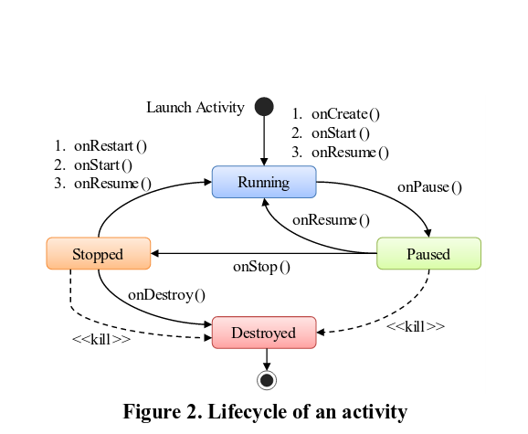

# READ6

### Citation

Liu, Y., Xu, C., & Cheung, S. C. (2014, May). Characterizing and detecting performance bugs for smartphone applications. In Proceedings of the 36th International Conference on Software Engineering (pp. 1013-1024). ACM. [Paper link](http://dl.acm.org/citation.cfm?id=2568229).

### Summary

The authors provide a bug pattern analysis of performance bugs in Android applications, with extensive experimental results.

### Keywords

* ii1. Performance bugs: Bugs that affect the feel of a program (e.g. responsiveness).
* ii2. Static code analyzer: A program that scans the code for bugs before execution (as opposed to during execution).
* ii3. Bug patterns: Common structure of code that bugs arise in (e.g. nested for-loops, like in the last READ assignment).
* ii4. Application lifecycle: An Android-specific concern is the "activity lifecycle". At any point in time, an activity can be told to restart or resume or stop or even be killed, so the user has to write cases to respond to these actions appropriately.

### Main Items

* iii1. Hypothesis/checklists: The authors quickly outline their goals with this research:
    * **RQ1 (bug types and impacts):** _What are common types of performance bugs in Android applications? What impacts do they have on user experience?_
    * **RQ2 (Bug manifestation):** _How do performance bugs manifest themselves? Does their manifestation need special inputs?_
    * **RQ3 (Debugging and bug-fixing effort):** _Are performance bugs more difficult to debug and fix than non-performance bugs? What information or tools can help with this?_
    * **RQ4 (Common bug patterns):** _Are there common causes of performance bugs? Can we distill common bug patterns to facilitate performance analysis and bug detection?_

* iii2. Visualization: The authors provide a small image outlining the lifecycle of an Android activity (Figure below). Having programmed on Android before, this image quickly triggered memories of the framework and API, so I understood exactly where they were coming from.

* iii3. Patterns: Complementing their research questions, in Section 3 of the paper, the authors end each subsection with a takeaway message. In general, these messages follow the form of pattern observation. For example:

> _Effective performance testing needs: (1) new coverage criteria to assess testing adequacy, (2) effective techniques for generating user interaction sequences to manifest performance bugs, and (3) automated oracles to judge performance degradation._

* iii4. Future work: The authors end with an outline of future work, specifically that they aim to recognize more patterns and compile a bug taxonomy. In addition to these "theory" results, the authors plan on introducing more practical and faster techniques.

# Improvements

* iv1. Repetition in too small of an area. On the first page, the authors have a list of research questions, and then a figure outlining the same questions but with boxes. I found the figure unnecessary, especially given the length discussion later in the paper.
* iv2. Proprietary results. The authors do a great job of explaining their context (working with performance bugs in Android applications), but do not have much (if any) commentary on the generality of their results. Do they expect them to apply to functional bugs? What about iOS or Windows applications? These are important follow-up questions.  
* iv3. Box-plots. The authors use box-pots to outline the bug differences between Firefox and Chrome. As a visualization tool, box-plots are not great, and would be better replaced in this instance with violin plots (box-plots + distribution details).
