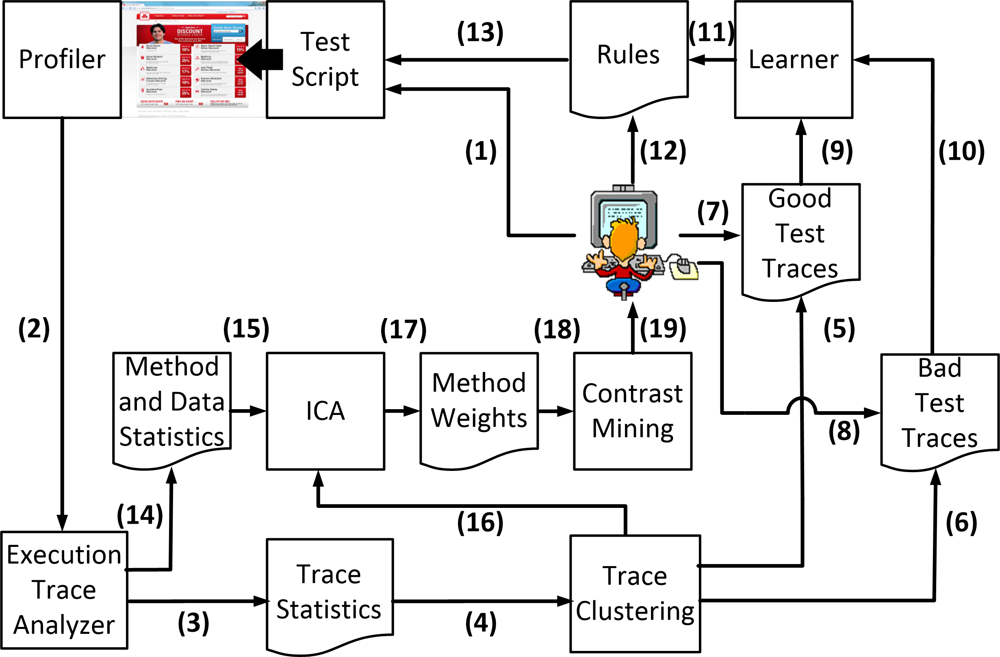

# READ8

### Citation

Luo, Q., Nair, A., Grechanik, M., & Poshyvanyk, D. (2016). Forepost: Finding performance problems automatically with feedback-directed learning software testing. Empirical Software Engineering, 1-51. [Paper link](https://link.springer.com/article/10.1007/s10664-015-9413-5).

### Summary

FOREPOST is a tool for efficiently selecting inputs for black-box application input testing.

### Keywords

* ii1. Performance testing: The authors define performance testing as finding situations when applications unexpectedly exhibit worsened characteristics for certain combinations of input values.
* ii2. Black-box software testing: This form of testing does not peak inside of the application, but merely selects and executes input values. The alternative is white-box testing, which uses the program's logical structure to formulate tests.
* ii3. Descriptive rules: Domain knowledge that can be used for developing tests.
* ii4. Feedback-driven performance testing: This form of testing utilizes the feedback from previous tests to inform the generation of the next tests.

### Main Items

* iii1. Tutorial: The authors start with a quick tutorial of what they call _application under test (AUT)_ testing, where an application is tested for performance issues without a deep understanding of the underlying code (e.g. black-box testing). They note how this can include GUI testing, and how domain knowledge typically has to be used to inform efficient algorithms. Specifically, they discuss _descriptive rules_, which the paper from READ7 called "effective rules" -- we need to generate input cases that tell us something concrete. In this case, we want to use black-box testing to develop some informal rules.
* iii2. Visualization. The authors provide a detailed image of FOREPOST's architecture (Figure below). This image is useful in outlining future discussions in the paper, giving the reader a reference for the implicit structure of the algorithm's pipeline.

* iii3. Scripts: The authors provide a full supplemental website with a video demo, high-res version of their architecture, code, and an installation tutorial. [Here's the link](http://www.cs.wm.edu/semeru/data/ICSE16-FOREPOST/).

* iii4. Related work: The authors end with an overview of related work. They menton how partition testing is used to divide a program's input domain into subdomains, such that each subdomain is covered. They also outline how learning rules are used by stakeholders to configure distributed systems for changing workloads. Finally, they contrast their approach with dynamic symbolic execution, where heuristics are used to generate tests that lead to longer executions.

# Improvements

* iv1. Data. While the authors kindly provide a demo and code, they do not provide any data to run the code on! At least providing the data to recreate the experimental plots would be appreciated.
* iv2. Few references to previous automated approaches to performance testing. The algorithms from READ5 and READ7 are both competitors to this algorithm, and the problem from READ6 admits compatible algorithms. Yet these papers are not mentioned specifically in the main body.
* iv3. More notation. The authors introduce a little notation early, but later move away from using the notation. This felt contradictory, either notation should be used primarily, or space should not be wasted with the initial definitions. 
